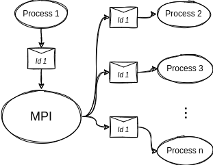
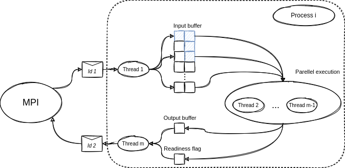

# Particle Swarm Optimization OpenMPI
/ParticleSwarmOptimization-openMPI/ provides an basic implementation of [PSO](https://en.wikipedia.org/wiki/Particle_swarm_optimization) with support for cluster computation through [OpenMPI](https://www.open-mpi.org/), moreover it uses [OpenMP](https://www.openmp.org/) for thread parallelization.

## OpeMPI
OpeMPI library is used to convey information across processes running on different nodes of a cluster. The basic information unit is composed as a broadcast message shared over the whole network, in this way all particles of Particle Swarm Optimization (PSO) are able to know all information associated to other members of the swarm.

The process that produces the message sends the message using a gather function because all particles must know the positions of other individuals of the population at every step. In the following picture it is presented a simple schema of the communication.

## Process
A process can have the task of computing the algorithm for one or more particles, it is divided in several threads that optimize the execution time of the process.

