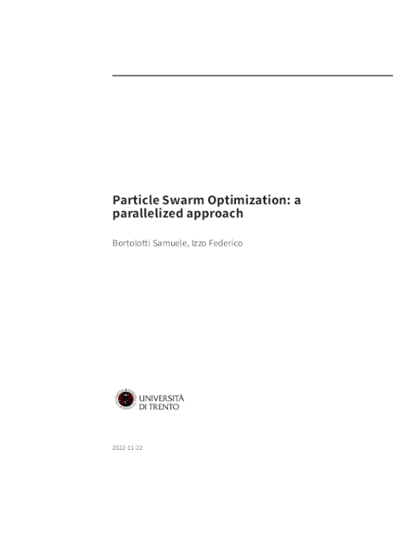
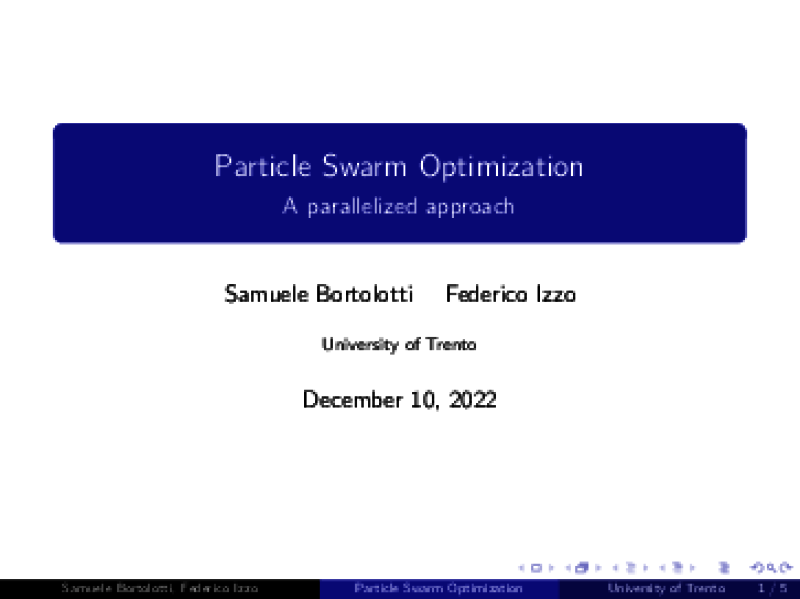

# Particle Swarm Optimization OpenMPI
<!-- markdown-toc start - Don't edit this section. Run M-x markdown-toc-refresh-toc -->
**Table of Contents**

- [Particle Swarm Optimization OpenMPI](#particle-swarm-optimization-openmpi)
    - [Build](#build)
        - [Binary](#binary)
        - [Docker](#docker)
        - [Nix](#nix)
        - [Udocker](#udocker)
	- [Run](#run)
        - [Local](#local)
        - [Cluster (through PBS)](#cluster-through-pbs)
	- [Report](#report)
    - [Dependencies](#dependencies)

<!-- markdown-toc end -->

*ParticleSwarmOptimization-openMPI* provides an basic implementation of [PSO](https://en.wikipedia.org/wiki/Particle_swarm_optimization) with support for cluster computation through [OpenMPI](https://www.open-mpi.org/), moreover it uses [OpenMP](https://www.openmp.org/) for thread parallelization.

| <a href="https://fedeizzo.github.io/ParticleSwarmOptimization-OpenMPI/report.pdf" target="_blank"><b>Long report</b></a> | <a href="https://fedeizzo.github.io/ParticleSwarmOptimization-OpenMPI/short-report.pdf" target="_blank"><b>Short report</b></a> | <a href="https://fedeizzo.github.io/ParticleSwarmOptimization-OpenMPI/presentation.pdf" target="_blank"><b>Presentaion</b></a> |
|--------------------------------------------------------------------------------------------------------------------------|---------------------------------------------------------------------------------------------------------------------------------|--------------------------------------------------------------------------------------------------------------------------------|
|                                                                                          |                                                                                           |                                                                                          |


<a href="https://fedeizzo.github.io/ParticleSwarmOptimization-OpenMPI/short-report.pdf" target="_blank"><b>PDF report can be found here (short version)</b></a>

## Build
### Binary
```bash
make
```

### Docker
```bash
make docker-build
```

with optional argument `DOCKER_TAG`

```bash
make DOCKER_TAG=mytag docker-build
```

### Nix
```
nix build .
```

### Udocker
```bash
make cluster-pull
```

## Run
### Local
```bash
./bin/particle-swarm-optimization pso-data.ini
```

or

```bash
mpirun -n <processesNumber ./bin/particle-swarm-optimization -u pso-data.ini
```

for optional arguments please execute `./bin/particle-swarm-optimization --help`.


### Cluster (through PBS)
Number of runs should be specified directly inside [this script](./scripts/generate_cluster_runs.sh)
```bash
make cluster-run
```

## Report
```bash
make report
```

or

```bash
nix build .#report
```

## Dependencies
If you have installed [nix package manager](https://nixos.org)
```bash
nix shell
```

otherwise dependencies are described below.

Build:

* OpenMPI
* sqlite C library
* make
* pkg-config
* OpenMP

Python dependencies for jupyter analysis:

* numpy
* jupyterlab or jupyter notebook
* pandas
* matplotlib

Documentation and report generation:

* pandoc
* doxygen
* latex with following packages:
  * adjustbox
  * babel-german
  * background
  * bidi
  * collectbox
  * csquotes
  * everypage
  * filehook
  * footmisc
  * footnotebackref
  * framed
  * fvextra
  * letltxmacro
  * ly1
  * mdframed
  * mweights
  * needspace
  * pagecolor
  * sourcecodepro
  * sourcesanspro
  * titling
  * ucharcat
  * ulem
  * unicode-math
  * upquote
  * xecjk
  * xurl
  * zref
