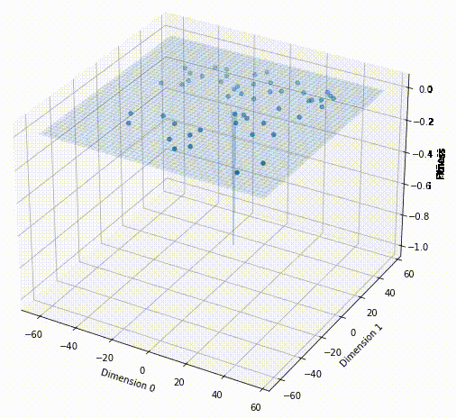
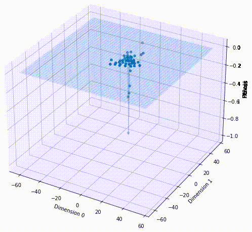
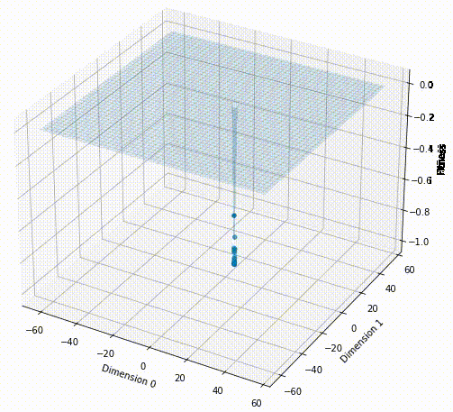
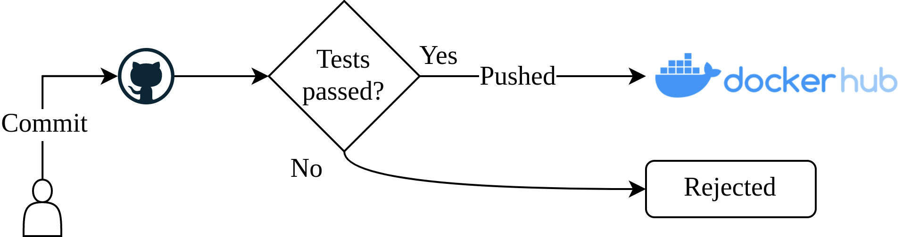
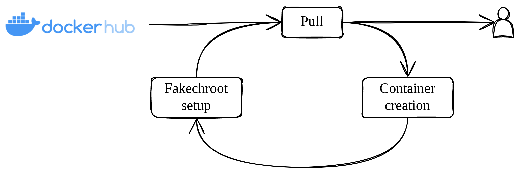
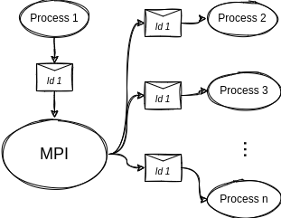
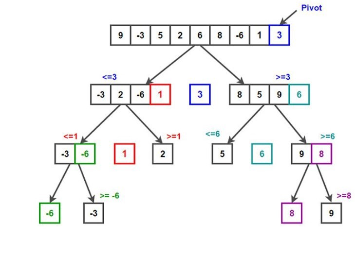

---
title:
- Particle Swarm Optimization
subtitle:
- A parallelized approach
aspectratio:
- 43
institute:
- University of Trento
author:
- \href{https://github.com/samuelebortolotti}{Samuele Bortolotti}
- \href{https://github.com/fedeizzo}{Federico Izzo}
date:
- \today
babel-lang:
- english
lang:
- en-US
section-titles:
- false
theme:
- Copenhagen
colortheme:
- default
navigation:
- horizontal
#logo: ../report/pandoc-template/logo.pdf
#logo-width: 10mm
fontsize:
- 10mm
link-citations: true
nocite: |
  @*
---

# Introduction

## Particle Swarm Optimization
Particle Swarm Optimization is an optimization algorithm for nonlinear functions based on bird swarms.

In PSO, a particle is characterized by:

- position $x$;
- velocity $v$;
- performance measure $f(x)$;
- personal best $y$;
- global best position $z$.

The solution is achieved by perturbing each particle according to the neighbors:

1. $v' = w \cdot v + \phi_1 U_1 \cdot (y-x) + \phi_2 U_2 \cdot (z-x)$
2. $x' = x+v'$

# Particle Swarm Optimization

## Easom function

$$f(x) = - \cos(x_1) \cos(x_2) \exp(-(x_1 - \pi)^2 - (x_2 - \pi)^2)$$

::: {.columns align=center}

:::: {.column width=27%}

{#fig:easom-before}

::::

:::: {.column width=27%}

{#fig:easom-mid}

::::

:::: {.column width=27%}

{#fig:easom-after}

::::

:::

# DevOps

## Pipeline
The proposed solution is provided with a pipeline for containers creation and usage suitable for a cluster environment.

$$ $$

::: {.columns align=center}

:::: {.column width=47%}

{#fig:container-creation}

::::

:::: {.column width=47%}

{#fig:container-pull}

::::

:::
# Analyzing the program behavior
In order to know each process and thread state and visualize a thread-safe logging library has been employed:
The logs follows a common pattern so as to be easily processed.

```
15:27:58 DEBUG : PSODATA    :: problem dimension :: 2
...
15:27:58 DEBUG : New best global solution found
...
15:27:58 INFO  : COMPUTING  :: iteration 10/10
Best fitness 4.690962
```

To recover the particles' positions during the entire program execution, we have stored each particle position at each iteration within a SQLite database.

# Serial version of the algorithm

\begin{center}
\scalebox{0.5}{
\begin{minipage}{1.5\linewidth}
\begin{algorithm}[H]
\caption{Particle Swarm Optimization (Nearest Neighbors)}
\begin{algorithmic}[1]
\Function{PSO}{$\mathcal{S}$, $\mathcal{D}$,  $MAX\_IT$, $n$, $f$, $v$, $x$, $x_{min}$, $x_{max}$, $v_{max}$}

\State \Call{Initialize}{$\mathcal{S}$, $\mathcal{D}$, $f$, $v$, $x$, $x_{min}$, $x_{max}$, $v_{max}$} 

\State $it = 0$
\Repeat
\ForAll {particle $i \in \mathcal{S}$}
\If{$f(x_{i}) < f(pb_{i})$}
    \State $pb_{i} \gets x_{i}$ 
\EndIf
\EndFor
\State $\mathcal{S'} = $ \Call{Copy}{$\mathcal{S}$}
\ForAll {particle $i \in \mathcal S$}
\State $\mathcal{S'}$ = \Call{Sort}{S', i}
\ForAll {particle $j \in \mathcal{S'}$}
\If{$f(x_j) < f(gb_{i})$}
    \State $gb_i \gets x_j$
\EndIf
\EndFor
\EndFor
\ForAll {particle $i \in \mathcal S$}
\ForAll {dimension $d \in \mathcal D$}
    \State $v_{i, d} = v_{i, d} + C_1 \cdot Rnd(0, 1) \cdot [pb_{i, d} - x_{i, d}] + C_2 \cdot Rnd(0, 1) \cdot [gb_{d} - x_{i, d}]$
    \State $x_{i, d} = x_{i, d} + v_{i, d}$
\EndFor
\EndFor
\State $it \gets it + 1$
\Until{it $<$ MAX\_ITERATIONS}
\State \Return x
\EndFunction
\end{algorithmic}
\end{algorithm}
\end{minipage}%
}
\end{center}

# Hybrid parallelization
We propose an all-to-all parallel computational solution using `MPI_Allgather`.

{#fig:parallel-architecture}

# Hybrid parallelization (cont'd)

Once each process knows everything about the others, PSO considers the neighbor contributions.

To compute the particle's neighboring positions we have employed the quicksort algorithm.

{#fig:quicksort-algorithm width=40%}

Finally, the algorithm evolves by updating velocity and position.

# Benchmarking, first conclusions
The problem we have decided to address consists in solving the sphere function $\left( f(x_1, x_2, \dots, x_n) = \displaystyle\sum_{i = 1}^{n} x_{i}^2 \right)$ with:

- 50 particle dimensions;
- 500 iterations;
- 5000 particles.

We have run around 1280 tests considering every possible combination of different parameters:

- processes: `[1 2 4 8 16 32 64]`;
- threads: `[1 2 4 8 16 32 64]`;
- chunks: `[1 2 3 4 5]`;
- places: `[pack scatter pack:excl scatter:excl]`.

# Benchmarking, time exceed
Many of the submitted experiments failed due to time exceeded errors. At a first sight, it seems that the failure rate is correlated with the increasing number of processes used for the computation.

{#fig:time-exceeded-jobs-per-process width=80%}

# Benchmarking, threads fault
A more depth analysis highlights that the problem is related to threads' overhead.

{#fig:thread-time-correlation}

# Benchmarking, single thread solution
* The time required for the execution decreases if the number of processes is increased;
* The proposed solution is influenced neither by the network overhead nor exclusive nodes.

{#fig:process-performances width=90%}


# State of the Art Analysis

| **Ref.**              | **Year** | **Type** &nbsp; | **Code** | **Note** |
|-----------------------|----------|-----------------|----------|----------|
| Kennedy et al. (1995) | 1995     | Serial          | No       | -        |
| @toddguant            | 2019     | Serial          | Yes      | 1        |
| @sousouho             | 2019     | Serial          | Yes      | 1        |
| @kkentzo              | 2020     | Serial          | Yes      | 1        |
| @fisherling           | 2020     | Serial          | Yes      | 1        |
| @MoraesMitre          | 2014     | MPI             | No       | -        |
| Nedja et al. (2017)   | 2017     | MPI/MP          | No       | -        |
| @abhi4578             | 2019     | MPI/MP,CUDA     | Yes      | 1        |
| @LaSEEB               | 2020     | OpenMP          | Yes      | 2        |
| @pg443                | 2021     | Serial,OpenMP   | Yes      | 1        |

only global neighborhood (1) no distance-based implementation (2) 

# Benchmarking, final remarks

::: {.columns align=center}

:::: {.column width=50%}

{#fig:parallel-speedup}

::::

:::: {.column width=50%}

{#fig:parallel-efficiency}

::::

:::

# Conclusion and future work
Up until this point, we produced a hybrid OpenMP-MPI algorithm to solve complex continuous optimization problems.

From the benchmarking analysis we claim:

- thread parallelization does not fit well our solution;
- benchmarking the algorithm is far from being trivial;
- the program provides its best result when the number of processes is limited.

As a future work, it would be interesting to:

- complement the already present architecture with different types of neighborhoods;
- analyze which configuration brought the best results.

# References {.allowframebreaks}
