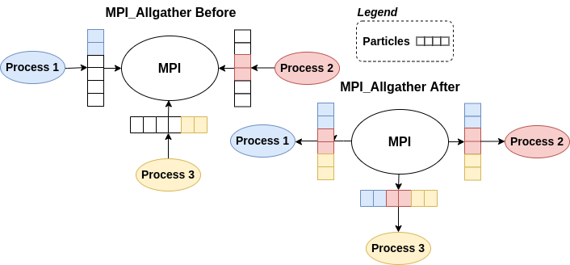

---
title:
- Particle Swarm Optimization
subtitle:
- A parallelized approach
aspectratio:
- 43
institute:
- University of Trento
author:
- \href{https://github.com/samuelebortolotti}{Samuele Bortolotti}
- \href{https://github.com/fedeizzo}{Federico Izzo}
date:
- \today
babel-lang:
- english
lang:
- en-US
section-titles:
- false
theme:
- Copenhagen
colortheme:
- default
navigation:
- horizontal
#logo: ../report/pandoc-template/logo.pdf
#logo-width: 10mm
fontsize:
- 10mm
link-citations: true
biblio-style: IEEEtran
nocite: |
  @*
---

# Introduction

## Particle Swarm Optimization

Particle Swarm Optimization is an optimization algorithm for nonlinear functions based on bird swarms.

A particle is characterized by:

- position $x$;
- velocity $v$;
- performance measure $f(x)$;
- personal best $y$;
- global best positions $z$.

The solution is achieved by perturbing each particle:

- $v' = w \cdot v + \phi_1 U_1 \cdot (y-x) + \phi_2 U_2 \cdot (z-x)$
- $x' = x+v'$

# Particle Swarm Optimization

## Easom function

$$f(x) = -\cos(x_1)\cos(x_2)\exp(-(x_1 - \pi)^2 - (x_2 - \pi)^2)$$

::: {.columns align=center}

:::: {.column width=30%}

{#fig:easom-before}

::::

:::: {.column width=30%}

{#fig:easom-mid}

::::

:::: {.column width=30%}

{#fig:easom-after}

::::

:::

# State of the Art Analysis

| **Ref.**           | **Year** | **Type**      | **Code** | **Note** |
|--------------------|----------|---------------|----------|----------|
| [@KennedyEberhart] | 1995     | Serial        | No       | -        |
| [@toddguant]       | 2019     | Serial        | Yes      | 1        |
| [@sousouho]        | 2019     | Serial        | Yes      | 1        |
| [@kkentzo]         | 2020     | Serial        | Yes      | 1        |
| [@fisherling]      | 2020     | Serial        | Yes      | 1        |
| [@MoraesMitre]     | 2014     | MPI           | No       | -        |
| [@NedJahMoraes]    | 2017     | MPI/MP        | No       | -        |
| [@abhi4578]        | 2019     | MPI/MP,CUDA   | Yes      | 1        |
| [@LaSEEB]          | 2020     | OpenMP        | Yes      | 2        |
| [@pg443]           | 2021     | Serial,OpenMP | Yes      | 1        |

> 1. provides only global neighborhood implementation.
> 2. provides PSO with different neighborhood versions but without a distance based approach.

# DevOps

Work in progress...

# Serial version of the algorithm

\begin{center}
\scalebox{0.5}{
\begin{minipage}{1.5\linewidth}
\begin{algorithm}[H]
\caption{Particle Swarm Optimization (Nearest Neighbors)}
\begin{algorithmic}[1]
\Function{PSO}{$\mathcal{S}$, $\mathcal{D}$,  $MAX\_IT$, $n$, $f$, $v$, $x$, $x_{min}$, $x_{max}$, $v_{max}$}

\State \Call{Initialize}{$\mathcal{S}$, $\mathcal{D}$, $f$, $v$, $x$, $x_{min}$, $x_{max}$, $v_{max}$} 

\State $it = 0$
\Repeat
\ForAll {particle $i \in \mathcal{S}$}
\If{$f(x_{i}) < f(pb_{i})$}
    \State $pb_{i} \gets x_{i}$ 
\EndIf
\EndFor
\State $\mathcal{S'} = $ \Call{Copy}{$\mathcal{S}$}
\ForAll {particle $i \in \mathcal S$}
\State $\mathcal{S'}$ = \Call{Sort}{S', i}
\ForAll {particle $j \in \mathcal{S'}$}
\If{$f(x_j) < f(gb_{i})$}
    \State $gb_i \gets x_j$
\EndIf
\EndFor
\EndFor
\ForAll {particle $i \in \mathcal S$}
\ForAll {dimension $d \in \mathcal D$}
    \State $v_{i, d} = v_{i, d} + C_1 \cdot Rnd(0, 1) \cdot [pb_{i, d} - x_{i, d}] + C_2 \cdot Rnd(0, 1) \cdot [gb_{d} - x_{i, d}]$
    \State $x_{i, d} = x_{i, d} + v_{i, d}$
\EndFor
\EndFor
\State $it \gets it + 1$
\Until{it $<$ MAX\_ITERATIONS}
\State \Return x
\EndFunction
\end{algorithmic}
\end{algorithm}
\end{minipage}%
}
\end{center}

# Hybrid parallelization

We propose an all-to-all parallel computational pattern using `MPI_Allgather`.

{#fig:parallel-architecture}

# Hybrid parallelization (cont'd)

Once each process knows everything about the others, PSO considers the neighbor contributions in order to update the process particles' position and velocity.

To compute the particle's neighboring positions we have employed the quicksort algorithm.

{width=50%}{#fig:quicksort-algorithm}

Finally, the algorithm evolves by updating velocity and position.

# Benchmarking, first conclusions

The problem we have decided to solve consists in solving the sphere function ($f(x_1, x_2, \dots, x_n) = \displaystyle\sum_{i = 1}^{n} x_{i}^2$) with:

- 50 particle dimensions
- 500 iterations
- 5000 particles 

We have run around 1280 tests considering every possible combination of different parameters:

- processes: chosen between `[1 2 4 8 16 32 64]`;
- threads: chosen between `[1 2 4 8 16 32 64]`;
- select: chosen between `[1 2 3 4 5]`;
- places: chosen between `[pack scatter pack:excl scatter:excl]`.

# Benchmarking, first conclusions (cont'd)

::: {.columns align=center}

:::: {.column width=45%}

{#fig:time-exceeded-jobs-per-process}

::::

:::: {.column width=45%}

{#fig:thread-time-correlation}

::::

:::

# Benchmarking, first conclusions (cont'd)

{#fig:process-performances}

# Benchmarking, final remarks

::: {.columns align=center}

:::: {.column width=45%}

{#fig:parallel-speedup}

::::

:::: {.column width=45%}

{#fig:parallel-efficiency}

::::

:::

# Conclusion

From our experiments we claim:

- thread parallelization does not fit well our problem;
- the program provides its best result when the number of processes is limited.

# References {.allowframebreaks}
