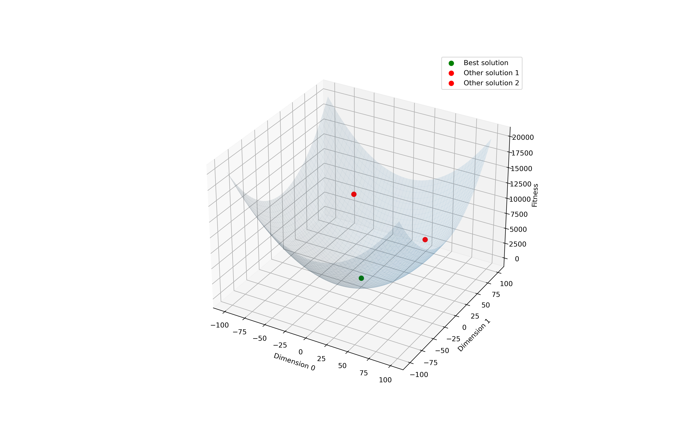

# Abstract
[*Particle Swarm Optimization*](https://doi.org/10.1109/ICNN.1995.488968) is an optimization algorithm for nonlinear function based on birds swarm. It falls back into the sub-field of *Bio-Inspired Artificial Intelligence* and it was designed from a simplified social model inspired by the nature.

A key concept associated with PSO is the role of genetic algorithms and evolution, the functioning is based on several iterations that aim to identify the best possible position represented as a point in a landscape (Figure 1).

PSO is originally attributed to James Kennedy and Russell Eberhart and was first intended for simulating social behavior in 1995.

The goal of this project is to design a parallelized implementation capable of exploring the solution space in a faster way. This is done though the usage of two main libraries for *High Performance Computing (HPC)*: *OpenMPI* and *OpenMP*.

The effectiveness of the proposed solution is tested using the HPC cluster of the University of Trento among other implementations found online.
