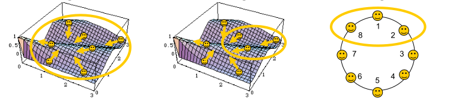

\newpage
# Introduction {#sec:introduction}

## Particle Swarm Optimization
In order to deeply understand the reasons behind the report design choices, it is fundamental to understand comprehensively *Particle Swarm Optimization*.

### Generalities
PSO focuses on two main definitions: the notion of *particle* and the one of *particle perception*.

A particle can be seen as an entity which is characterized by:

- a position $x$ depicting the *candidate solution* for our optimization problem;
- a velocity component $v$, which is used in order to *perturb* the particle;
- a performance measure $f(x)$, also called *fitness* value, which quantify the quality of the candidate solution.

The entire set of particles is referred as *swarm*.

Under the expression *particle perception*, we define how each particle communicate with each other. In practice, a particle needs to perceive the positions along with the associated performance measures of the *neighboring particles*. Thanks to this communication pattern, each particle remembers the position $z$ associated to the best performance of all the particles within the neighborhood, as well as its own best performance so far $y$.

There are different structures of neighborhood which can be considered (figure {@fig:pso-topologies}), and they usually depend on the type of optimization problem one has to face.

The most relevant types of neighborhood are: 

- *Global*: the best individual in the neighborhood is also the *global* best in the entire swarm;
- *Distance-based*: based on a proximity metric (e.g. euclidean distance);
- *List-based*: based on a predetermined topology arranging the solution indexes according to some order or structure, and a given neighborhood size.

{#fig:pso-topologies}

This project implements a version of PSO considering *distance-based* neighborhood in a nearest neighbor fashion. In details, each particle has a fixed number of neighbors, which depend dynamically on the particle position on the landscape. The program offers the user the possibility to modify the number of particles to consider within a particle neighborhood.

### Parametrization
In order to assess a solution for an optimization problem, PSO requires the following parameters to be set:

- *Swarm size*: typically 20 particles for problems with dimensionality 2-200;
- *Neighborhood size*: typically 3 to 5, otherwise global neighborhood;
- *Velocity update factors*.

### Continuous Optimization
Once the algorithm has been parametrized, a swarm of particles is initialized with random positions and velocity.

At each step, each particle updates first its velocity (equation {@eq:pso-update-velocity}):

$$v' = w \cdot v + \phi_1 U_1 \cdot (y-x) + \phi_2 U_2 \cdot (z-x)$$ {#eq:pso-update-velocity}

where:

- $x$ and $v$ are the particle current position and velocity, respectively;
- $y$ and $z$ are the personal and social/global best position, respectively;
- $w$ is the inertia (weighs the current velocity);
- $\phi_1$, $\phi_2$ are acceleration coefficients/learning rates (cognitive and social, respectively);
- $U_1$ and $U_2$ are uniform random numbers in $[0,1]$.

Finally, each particle updates its position (equation {@eq:pso-update-position}):

$$x' = x+v'$$ {#eq:pso-update-position}

and in case of improvement, update $y$ (and eventually $z$).

The loop is iterated until a given stop condition is met.

The pseudocode of the algorithm is shown below:

\begin{algorithm}[H]
\caption{Initialize}
\begin{algorithmic}[1]
\Procedure{Initialize}{$\mathcal{S}$, $\mathcal{D}$, $f$, $v$, $x$, $x_{min}$, $x_{max}$, $v_{max}$}
\ForAll {particle $i \in \mathcal S$}
\ForAll {dimension $d \in \mathcal D$}
\State $x_{i, d} \gets Rnd(x_{min}, x_{max})$ \Comment{Initialize the particles' positions}
\State $v_{i, d} \gets Rnd(-v_{max}/3, v_{max}/3)$ \Comment{Initialize the particles' velocity}
\EndFor
\EndFor

\State $pb_i \gets x_i$ \Comment{Initialize the particle best position}
\State $gb_i \gets x_i$ \Comment{Update the particle's best position}
\EndProcedure
\end{algorithmic}
\end{algorithm}

\begin{algorithm}[H]
\caption{Particle Swarm Optimization (Nearest Neighbors)}
\begin{algorithmic}[1]
\Function{PSO}{$\mathcal{S}$, $\mathcal{D}$,  $MAX\_IT$, $n$, $f$, $v$, $x$, $x_{min}$, $x_{max}$, $v_{max}$}

\State \Call{Initialize}{$\mathcal{S}$, $\mathcal{D}$, $f$, $v$, $x$, $x_{min}$, $x_{max}$, $v_{max}$} 
\Comment{Initialize all the particles}

\State $it = 0$
\Repeat
\ForAll {particle $i \in \mathcal{S}$}
\If{$f(x_{i}) < f(pb_{i})$}
    \State $pb_{i} \gets x_{i}$ 
\Comment{Update the particles' best position}
\EndIf
\EndFor
\State $\mathcal{S'} = $ \Call{Copy}{$\mathcal{S}$} \Comment{Copy the particle's vector}
\ForAll {particle $i \in \mathcal S$}
\State $\mathcal{S'}$ = \Call{Sort}{S', i} \Comment{Sort the particles w.r.t. $i$th particle}
\ForAll {particle $j \in \mathcal{S'}$}
\If{$f(x_j) < f(gb_{i})$}
    \State $gb_i \gets x_j$
\EndIf
\EndFor
\EndFor
\ForAll {particle $i \in \mathcal S$}
\ForAll {dimension $d \in \mathcal D$}
    \State $v_{i, d} = v_{i, d} + C_1 \cdot Rnd(0, 1) \cdot [pb_{i, d} - x_{i, d}] + C_2 \cdot Rnd(0, 1) \cdot [gb_{d} - x_{i, d}]$
    \State $x_{i, d} = x_{i, d} + v_{i, d}$ \Comment{Update the velocity and positions}
\EndFor
\EndFor
\State $it \gets it + 1$ \Comment{Advance iteration}
\Until{it $<$ MAX\_ITERATIONS}
\State \Return x
\EndFunction
\end{algorithmic}
\end{algorithm}

## MPI
The MPI (Message Passing Interface) library is used to convey information across processes running on different nodes of a cluster.

In the scenario described by the application, the basic information unit is composed as a broadcast message shared over the whole network, in this way all particles of PSO are able to know all information associated to other members of the swarm.

## OpenMP
OpenMP is an API which supports multi-platform shared memory programming.

In the program scenario, a process is delegated to handle the computing regarding one or more particles. The process job is divided in several threads which optimize the execution time of the process.

## State-of-the art analysis {#sec:sota-analysis}
The first serial implementation of PSO was published in 1995 by Kennedy and Eberhat [@KennedyEberhart]. After that, many variations of PSO were proposed in the literature. 

Based on what we have found, the approaches can be divided into three main categories:

1. those ones which aim to change the behavior of the algorithm introducing new features;
2. those ones which aim to solve a real world problem using PSO as main algorithm;
3. those ones which aim to optimize the runtime execution speed.

In our study we have decided to exclude the second category of PSO algorithms since these solutions are strictly problem dependent. Thus, a comparison would produce meaningless results. 

On the other hand, all those approaches which belong to first category of problems can be employed as case studies for our benchmarking analysis. However, it is strictly required to change some implementation aspects by modifying directly the code. In some cases, this requires a deep understanding of others' code, most of the time a though job due to the absence of documentation. 

For instance, the topology used within the neighborhood selection highly influences the final performance of the algorithm. As an effective representation, we can think about the global neighborhood in comparison with the distance based one. In the first scenario, the global best solution is shared among each swarm unit, and it is given by the best value reached by each particle. Hence, a simple reduce without further computation will suffice. Instead, a distance based neighborhood requires to consider the best solutions within a certain range of particles, which implies that all the swarm units need to know all the others' positions. This inevitably imply a considerable increase in time complexity. 

The third category is our perfect competitor, since they share our same objective.
However, there are several cases in which different PSO version have been implemented. Hence, some hands on is still required.

In the following table we list some of the implementations we have decided to consider during the benchmarking phase.

| Authors                                                  | Year | Type                      | Source code                                                     | Notes |
|----------------------------------------------------------|------|---------------------------|-----------------------------------------------------------------|-------|
| Kennedy, Eberhart [@KennedyEberhart]                     | 1995 | Serial                    | No                                                              |       |
| toddguant [@toddguant]                                   | 2019 | Serial                    | [Yes](https://github.com/toddgaunt/cpso)                        | 1     |
| sousouho [@sousouho]                                     | 2019 | Serial                    | [Yes](https://github.com/sousouhou/succinctPSO)                 | 1     |
| kkentzo [@kkentzo]                                       | 2020 | Serial                    | [Yes](https://github.com/kkentzo/pso)                           | 1     |
| fisherling [@fisherling]                                 | 2020 | Serial                    | [Yes](https://github.com/fischerling/pso)                       | 1     |
| Moraes, Mitre [@MoraesMitre]                             | 2014 | Parallel OpenMPI          | No                                                              |       |
| Nedja, Moraes, Rogerio, Marcedo Mourelle [@NedJahMoraes] | 2017 | Parallel OpenMPI/MP       | No                                                              |       |
| abhi4578 [@abhi4578]                                     | 2019 | Parallel OpenMPI/MP, CUDA | [Yes](https://github.com/abhi4578/Parallelization-of-PSO)       | 1     |
| LaSEEB [@LaSEEB]                                         | 2020 | Parallel OpenMP           | [Yes](https://github.com/LaSEEB/openpso)                        | 2     |
| pg443 [@pg443]                                           | 2021 | Serial, Parallel OpenMP   | [Yes](https://github.com/pg443/Particle-Swarm-Optimizer-OpenMP) | 1     |
Table: SOTA works.

The indexes in the notes refer to:

1. provides only global neighborhood implementation. Thus, the comparison would be untruthful as those implementations have a clear advantage in the execution time due to a favorable topology;
2. provides PSO with different neighborhood versions but without a distance based approach. Hence, the implication are the same as for the point 1.

According to the previous statements, we claim that we have implemented a PSO version which differ from the ones we have decided to consider since it has a different notion of neighborhood which makes it harder to parallelize.

## Project generalities

In the following sections, the report addresses how to setup and run the program.

### Libraries
The project requires few libraries in order to work properly. As it is mandatory for the course, [OpenMP](https://www.openmp.org/) and [MPI](https://www.open-mpi.org/) were employed. 
Along with the compulsory libraries, the following ones were exploited:

- [sqlite](https://www.sqlite.org/index.html): SQLite is a C-language library that provides a SQL database engine that is tiny, quick, self-contained, high-reliability, and full-featured. The choice of `sqlite` was made in order to save particles' information at each iteration in an simple and fast way, avoiding dealing with race conditions.

- [argp](https://www.gnu.org/software/libc/manual/html_node/Argp.html): `argp` is a parsing interface for unix-style argument vectors.
The argp features include, as defined in the GNU coding standards, automatically producing output in response to the `--help` and `--version` options and the possibility for programmers to explicitly define the input of the script. This library was employed in order to allow the user to explore the possible configurations made available by the software.

- [check](https://libcheck.github.io/check/): `check` is a unit testing framework written in C. It has a straightforward interface for defining unit tests helping the developer to build robust software. This library was included in the application in order to perform unit-testing on the structure we have created. This choice implies a more robust software.

### Build
In order to build the executable file of our project, as well as the binary file needed to run the project unit test, we have employed [GNU Make](https://www.gnu.org/software/make/).

GNU Make is a tool which manages the creation of executables and other non-source files from a program's source files. Make learns how to create your software using a file called the `Makefile`, which lists each non-source file and how to compute it from other files.

Thanks to the definitions of rules, Make enables the user to build and install packages without knowing the details on how that is done. 

Moreover, thanks to wildcards, it is easy to automate the application building process. Indeed, it first allotraduttorews to assemble each `C` source file in order to create the object files. Then, all of the object files are linked together, along with other libraries, in order to produce the final executable file. If the building rule is called multiple times, Make is smart enough to understand whether an object file needs to be recreated or not, making use of the already assembled objects, thus speeding up the building process.

Furthermore, Make can do much more than compiling software, for instance, the project contains rules which allow to build and open the code documentation written by the means of [Doxygen](https://doxygen.nl/).

In order to get the right flag for linking the needed external, the project employs [pkg-config](https://people.freedesktop.org/~dbn/pkg-config-guide.html). This package collects metadata about the installed libraries on the system and easily provides it to the user. Hence, `pkg-config` takes care of where a library is located regardless of the distribution simplifying the application building process.

#### Compile
To compile the project, it is possible to call the Makefile by typing:

```bash
make build
```

In this way, the executable `bin/particle-swarm-optimization` is ready to be launched.

Instead, to build the unittest, it is possible to execute the following command.

```bash
make test
```

The artifact is located in the `bin` directory and it is called `test`.

Along with the executable files, there are also scripts used to run the program within the University cluster. Each job in the cluster is handled by *PBS (Portable Bash Script)* which submits them to the scheduler. By means of a script, it is possible to tell the scheduler what resources the job requires in order to complete (e.g. number of processors, amount of memory, time to complete etc.) and the application the user wants to run.

The `run.sh` file in the `scripts` folder of the repository allows the user to submit the application to the cluster. The script has three parameters: number of processes, path of the ini file containing the program configuration and the number of threads. Once submitted with the `qsub` command, the script generates a number of docker containers equal to the number of specified processes thanks to the `mpiexec` binary. Each container runs the application in a shared network, therefore each process is able to communicate with each other. The details of the program deployment is discussed in the section {@sec:devops}.

The `generate_cluster_run.sh` file, contained in the `scripts` folder, is employed to generate specific runs in order to benchmark the application. In details, the shell file considers several combinations of processes, threads, nodes and places. More details are provided in section {@sec:benchmarking}.

### Execute
The executable file can be invoked with or without `OpenMP` and with or without `OpenMPI`. However, to fully exploit `OpenMPI`, it is recommended to execute the program `mpiexec` to spawn multiple processes of the multi-process application.

The executable file requires several arguments. Below there is an excerpt of the program output when the `--help` flag is called.

```
A Cooperating parallelized solution for Genetic Algorithm. A tool that takes a set of continuous or discrete variables and an optimization
problem designed to work with them. The goal is to find the optimal solution by
exploiting Genetic Algorithms and the computational power offered by the cluster

  -m, --number-of-threads[=COUNT]
                             Number of threads for process
  -u, --use-openmpi          Use OpenMPI
  -?, --help                 Give this help list
      --usage                Give a short usage message
  -V, --version              Print program version
```

In order to run, the application requires three parameters, two of them are optional, while one is mandatory.

The compulsory parameter is the configuration file, which needs to be provided in an `INI file`. This file, takes care of all the parameters which are needed by the Particle Swarm Optimization algorithm to run and which have been fully discussed during the introduction to the problem.
The repository provides a standard `INI` file, called `pso-data.ini`, which can be modified in order to configure algorithm so as to solve the target problem.

It is possible to specify the number of threads the program is allowed to spawn for each process with the `-m` flag, and whether to employ `MPI` primitives or not with the `-u` flag.
