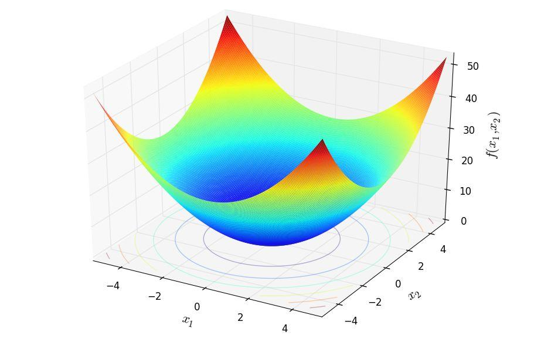

# Problem Analysis
As explained during the introductory part, the main focus of the PSO algorithm is to find an approximate solution of a continuous optimization problem. Therefore, we have relied on some of the most relevant benchmark functions for continuous optimization. The experiments focuses mostly on six of them, which are listed below:

- `sphere function`: unimodal function suitable for single objective optimization. The single optimum is located in $\vec{x} = \vec{0}$. The sphere function is defined as follows:
$$\vec{x} \; \textnormal{argmin} f(x_1, x_2, \dots, x_n) = \displaystyle\sum_{i = 1}^{n} x_{i}^2$$
{ width=250px }
- `wave function`: TODO
- `Easom function`: ultimodal function suitable for single objective optimization. The single optimum is located in $\vec{x} = \vec{\pi}$. The Easom function is defined as:
$$f(x) = -\cos(x_1)\cos(x_2)\exp(-(x_1 - \pi)^2 - (x_2 - \pi)^2)$$
{ width=250px }
- `Ackley function`: unimodal function suitable for single objective optimization. The single optimum is located in $\vec{x} = \vec{0}$. The Ackley function is defined as:
$$f(x) = -a \exp \left(-b \displaystyle\sqrt{\frac{1}{d}\displaystyle\sum_{i=1}^{d} x_i^2} \right) - \exp \left( \frac{1}{d} \displaystyle\sum_{i = 1}{d} \cos(cx_i) \right) + a + \exp(1)$$
{ width=250px }
- `Himmelblau function`: multimodal function suitable for single objective optimization. The function presents four identical minima: $f(\vec{x}) = f(3.0, 2.0) = f(-2.805118, 3.131312) = (-3.779319, -3.283186) = f(3.584428, -1.848126) = 0.0$
The function is defined as:
$$f(x, y) = (x^2 + y - 11)^2 + (x + y^2 - 7)^2$$
{ width=250px }
- `Holder table function`: multimodal function suitable for single objective optimization. The function presents four identical minima: $f(\vec{x}) = f(8.05502, 9.66459) = f(8.05502, 9.66459) = (8.05502, 9.66459) = f(8.05502, 9.66459) = -19.2085$. The function is defined as:
$$f(x) = -\left|\sin(x_1)\cos(x_2)\exp \left( 1 - \frac{\sqrt{x_1^2 + x_2^2}}{\pi}\right)\right|$$
{ width=250px }

For the sake of the explainability, the functions presented above shows the two-dimensional case. Of course, such functions can scale up to as many dimensions as one desires.

Moreover, our particle swarm optimization implementation can handle also other functions. Indeed, it is possible to define the proper single objective function to optimize in the `problems.h` and `problems.c` files, specifying it in the configuration along with the *fitnessGoal*, namely, whether the function needs to be maximized or minimized.

## Serial version of the algorithm
As can be seen from the PSO pseudocode shown in the introduction, the main steps the algorithm has to face are:

1. initialize the particles in the swarm according to the problem dimensionality;
2. exchange particles' positions among within the swarm;
3. sort the particles according to a distance measure (euclidean distance) in ascending order;
4. update the particles position and velocity.

### Serial algorithm optimization
As mentioned in the introduction section, the program provides the possibility to either run on a single thread or on multiple threads. The multithreading functionalities exploited by the application are offered by the OpenMP library.

As a first approach, we have tried to use OpenMP directives in order to generate a thread for each loop iteration whenever it was possible.

To prevent contaminating the spaces of other threads, the actions inside the *for* loop worked on distinct data structures and variables.

For example, we inserted the relative OpenMP directive every time there was the need to loop though all the particles.

However, OpenMP *fork-join* model requires a non negligible overhead so as to spawn multiple threads which are eventually joined into the master at the end of the OpenMP block. For relatively small problems, this operation was a time-consuming procedure which leads to a significant rise in execution time with respect to the single thread model. Moreover, during the experiments we have not been able to observe the threads advantage we were hoping for. We assume that the main reason behind this non-tangible advantage are the optimization provided by `gcc` during at compile time and the non.optimal thread allocation patterns performed on the cluster. Indeed, it is not rare to observe different threads being executed on the same computational unit, which clearly slows down the computation due to the overhead required by the context switching operation.

In the final version of the application, we have included the OpenMP directives only in the portion of the code where we thought it was needed, even if the advantage in terms of time were not satisfactory compared to the single threaded application.

#### Exchange particles' information
In the serial version of the application, each particle is stored within an array data structure, therefore with a two-level nested loop, it is possible to make every particle contribution to each other. In this case, as each particle handles a different portion of the memory, a *pragma for* directive is included.

#### Sorting algorithm
Concerning the sorting algorithm, the program relies on *quicksort*. The main reason behind this choice is the amount of parallelization this algorithm can provide. Indeed, merge sort has a better worst-case performance $\mathcal{O}(n \log n)$ with respect to quicksort having $\mathcal{O}(n^2)$ but requires synchronization in order to merge the partial solutions which is not required in quicksort. Moreover, its average performance is $\mathcal{O}(n \log n)$ as for merge sort.

The parallel quicksort main working loop can be described as follows. Before going into the implementation details, in the base settings we have a pool of threads provided by the OpenMP library which can be called whenever is needed, and an array of items that needs to be sorted. 

Initially, one thread selects a pivot and moves the elements of the array which are smaller than the pivot value to the left and the elements which are bigger than the pivot value to the right.
The resulting two portions of the array wait until there is a free thread ready to process it. 

{ width=250px }

## Parallel version of the algorithm

### Architecture

### Communication pattern

### Message

### Logs

### Output and SQLite