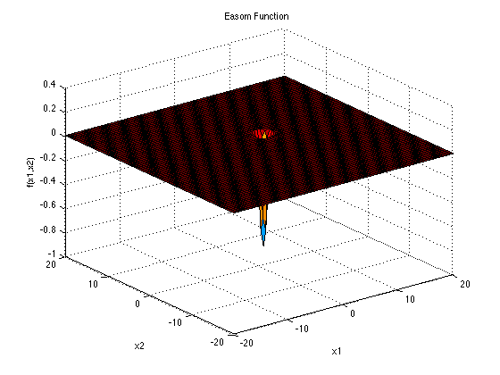
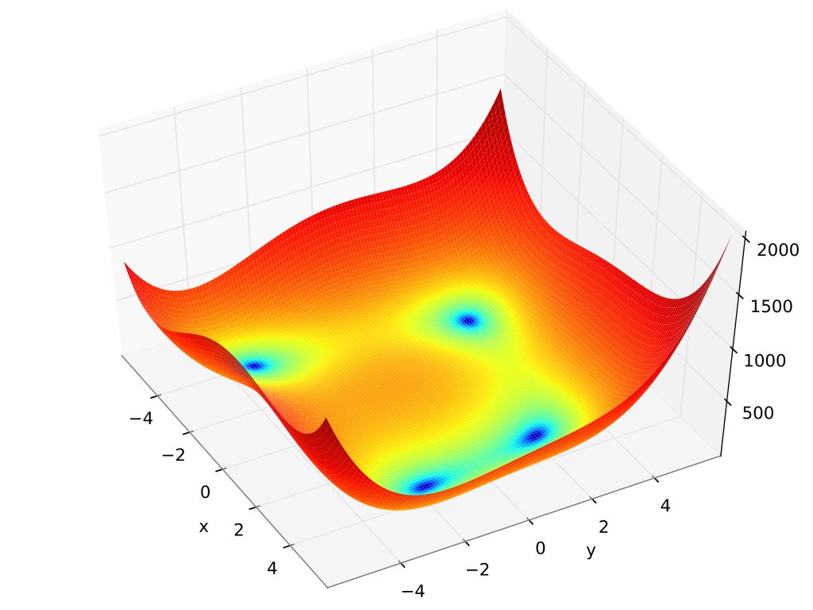

\newpage
# Problem Analysis
As explained during the introductory part, the main focus of the PSO algorithm is to find an approximate solution of a continuous optimization problem. Therefore, we have relied on some of the most relevant benchmark functions for continuous optimization. The experiments focuses mostly on six of them, which are listed below:

- `sphere function`: unimodal function suitable for single objective optimization. The single optimum is located in $\vec{x} = \vec{0}$. The sphere function is defined as follows:

$$\vec{x} \; \textnormal{argmin} f(x_1, x_2, \dots, x_n) = \displaystyle\sum_{i = 1}^{n} x_{i}^2$$

{ width=250px }

- `wave function`: unimodal function suitable for single objective optimization. The function does not admit a single optimum, however the fitness increases as long as $x$ approaches to $-\infty$. The wave function is defined as follows:

$$ f(x,y) = x^3 + y^2 $$

{ width=400px }

- `Easom function`: ultimodal function suitable for single objective optimization. The single optimum is located in $\vec{x} = \vec{\pi}$. The Easom function is defined as:

$$f(x) = -\cos(x_1)\cos(x_2)\exp(-(x_1 - \pi)^2 - (x_2 - \pi)^2)$$

{ width=250px }

- `Ackley function`: unimodal function suitable for single objective optimization. The single optimum is located in $\vec{x} = \vec{0}$. The Ackley function is defined as:

$$f(x) = -a \exp \left(-b \displaystyle\sqrt{\frac{1}{d}\displaystyle\sum_{i=1}^{d} x_i^2} \right) - \exp \left( \frac{1}{d} \displaystyle\sum_{i = 1}{d} \cos(cx_i) \right) + a + \exp(1)$$

{ width=250px }

- `Himmelblau function`: multimodal function suitable for single objective optimization. The function presents four identical minima: $f(\vec{x}) = f(3.0, 2.0) = f(-2.805118, 3.131312) = (-3.779319, -3.283186) = f(3.584428, -1.848126) = 0.0$
The function is defined as:

$$f(x, y) = (x^2 + y - 11)^2 + (x + y^2 - 7)^2$$

{ width=250px }

- `Holder table function`: multimodal function suitable for single objective optimization. The function presents four identical minima: $f(\vec{x}) = f(8.05502, 9.66459) = f(8.05502, 9.66459) = (8.05502, 9.66459) = f(8.05502, 9.66459) = -19.2085$. The function is defined as:

$$f(x) = -\left|\sin(x_1)\cos(x_2)\exp \left( 1 - \frac{\sqrt{x_1^2 + x_2^2}}{\pi}\right)\right|$$

{ width=250px }

For the sake of the explainability, the functions presented above shows the two-dimensional case. Of course, such functions can scale up to as many dimensions as one desires.

Moreover, our particle swarm optimization implementation can handle also other functions. Indeed, it is possible to define the proper single objective function to optimize in the `problems.h` and `problems.c` files, specifying it in the configuration along with the *fitnessGoal*, namely, whether the function needs to be maximized or minimized.

## Program configuration

## Serial version of the algorithm
As can be seen from the PSO pseudocode shown in the introduction, the main steps the algorithm has to face are:

1. initialize the particles in the swarm according to the problem dimensionality;
2. exchange particles' positions among within the swarm;
3. sort the particles according to a distance measure (euclidean distance) in ascending order;
4. update the particles position and velocity.

### Serial algorithm optimization
As mentioned in the introduction section, the program provides the possibility to either run on a single thread or on multiple threads. The multithreading functionalities exploited by the application are offered by the OpenMP library.

As a first approach, we have tried to use OpenMP directives in order to generate a thread for each loop iteration whenever it was possible.

To prevent contaminating the spaces of other threads, the actions inside the *for* loop worked on distinct data structures and variables.

For example, we inserted the relative OpenMP directive every time there was the need to loop though all the particles.

However, OpenMP *fork-join* model requires a non negligible overhead so as to spawn multiple threads which are eventually joined into the master at the end of the OpenMP block. For relatively small problems, this operation was a time-consuming procedure which leads to a significant rise in execution time with respect to the single thread model. Moreover, during the experiments we have not been able to observe the threads advantage we were hoping for. We assume that the main reason behind this non-tangible advantage are the optimization provided by `gcc` during at compile time and the non.optimal thread allocation patterns performed on the cluster. Indeed, it is not rare to observe different threads being executed on the same computational unit, which clearly slows down the computation due to the overhead required by the context switching operation.

In the final version of the application, we have included the OpenMP directives only in the portion of the code where we thought it was needed, even if the advantage in terms of time were not satisfactory compared to the single threaded application.

#### Particles' initialization
Since only one process is involved, the initialization step is trivial, as it requires to create a given number of particles sequentially, which are immediately stored within an array data structure.

#### Exchange particles' information
In the serial version of the application, each particle is stored within an array data structure, therefore with a two-level nested loop, it is possible to make every particle contribution to each other. In this case, as each particle handles a different portion of the memory, a *pragma for* directive is included.

#### Sorting algorithm
Concerning the sorting algorithm, the program relies on *quicksort*. The main reason behind this choice is the amount of parallelization this algorithm can provide. Indeed, merge sort has a better worst-case performance $\mathcal{O}(n \log n)$ with respect to quicksort having $\mathcal{O}(n^2)$ but requires synchronization in order to merge the partial solutions which is not required in quicksort. Moreover, its average performance is $\mathcal{O}(n \log n)$ as for merge sort.

The parallel quicksort main working loop can be described as follows. Before going into the implementation details, in the base settings we have a pool of threads provided by the OpenMP library which can be called whenever is needed, and an array of items that needs to be sorted. 

Initially, one thread selects a pivot and moves the elements of the array which are smaller than the pivot value to the left and the elements which are bigger than the pivot value to the right.
The resulting two portions of the array wait until there is a free thread ready to process it. 

{ width=250px }

#### Velocity and position update
As for the initialization step, the process consists in a for loop which scans all the particles' data, and applies the formula according to the algorithm list in the introduction section.

## Parallel version of the algorithm
In this section the report discuss how we have parallelized the algorithm in order to speed up the performance.

In practice, we have distributed the workload among $N$ different processes in the cluster using the *MPI* library and we have exploited multiprocessing via OpenMP for a couple of different shared-memory tasks.

### Architecture
In order to subdivide the work and to carry out the final computation, the architecture proposed by the report focuses on the *all-to-all* parallel computational pattern.

*All-to-all* parallel pattern is characterized by the exchange of individual messages from every process to any other processor. In this way, the program effectively uses all the processes in order to carry out the computation, as the coordination operations are handled by MPI.

TODO

### Message
To send a message between different processes we created a custom MPI data type called broadcastMessage_t.
Its purpose is to inform the receiver process about the particles' position and fitness of the sender. The structure is composed by a timestamp, which is needed for logging purposes on the sqlite, the current iteration of the algorithm, the identifier of the particle, the sender rank and the current solution.

On the other hand, solution is another structured datatype, which has been defined in order to carry a specific particle information.
This structured datatype contains the problem dimensionality, the fitness value of the candidate solution and the vector depicting the current particle position within the fitness landscape.

So as to create a variable of the previously mentioned message data type, we have defined a proper function called define_datatype_broadcast_message. This function, in turn, calls the function required to defined a message carrying the a solution type variable and a timestamp type variable.

The stratification above has simplified the MPI_Datatype definition process. 

### Communication pattern
The communication between the different processes is synchronous.

Firstly, each process takes charge of a given number of particles.
In details, let $N$ be the number of particles the user has requested to program to manage and let $p$ be the number of processes available to *MPI*. Without the need of synchronization nor of message exchange, each process creates $N / p$ particles and the remaining $N \% p$ ones are split among the remaining processes. This was possible by exploiting the number of processes and the process rank in the following way:

```C
int particlesNumberPerProcess = particlesNumber / n_processes;
int particlesNumberReminder = particlesNumber % n_processes;
int processToNumberOfParticles[n_processes];
for (int i = 0; i < n_processes; i++) {
  processToNumberOfParticles[i] = particlesNumberPerProcess;
  if (i != 0 && i <= particlesNumberReminder)
    processToNumberOfParticles[i]++;
}
```

In this way, the $i$-th rank process has `processToNumberOfParticles[i]` particles to handle and, at the same time, knows how many particles the other processes have to manage which will be useful later when handling message communication. The possibility of coordinate the processes without synchronization calls or messages provides a relevant improvement in the application performances.

The most interesting part in the algorithm parallelization is the program segment related to the message exchange among multiple processes.

To carry out this operation, each process embeds its own particles in an array of `define_datatype_broadcast_message`. Then, the particle information exchange happens with an `MPI_Allgather` communication primitive.

In principle, at the beginning of the algorithm execution, the set of all the particles have been distributed across all processes. However, this operation has been carried out by each process alone without the need for a `MPI_Scatter` call.

`MPI_Allgather` primitive is suitable for the problem since it is an *all-to-all* communication primitive and since it allow to reunite all the particles of each process into a single vector, which, at the end of the communication, will be equal for each process. A scheme illustrating the working behavior of the communication primitive employed is shown below:

{ width=250px }

Once each process knows everything about the others, the application needs to consider the neighbor contributions in order to update the process particles' position and velocity.

At this point, each process can sort all the particles, whose position is known thanks to the `MPI_Allgather` communication, with respect to all particles proper to the process, according to the euclidean distance. In this way, for each process particle is possible to identify the $k$-th nearest neighbors.

Finally, by applying the position and velocity update formulas listed in the PSO pseudocode it was possible to evolve the algorithm and approach the target function optima.

Moreover, with the help of OpenMP we have parallelized the computation of the sorting algorithm as well as the loop needed in order to update the algorithm variables.

We have observed that the workload split implied by the algorithm enhance the PSO performances. A first, and trivial way to observe the advantage offered by *MPI* and optimization is to give a look at some of the expensive computation the serial algorithm has to carry out, in particular, let $n$ be the number of particles and let $m$ be the problem dimensionality. Moreover, during this reasoning process, we consider the average performance case and the single threaded scenario.

1. the distance computation is quadratic in the number of particles, while the euclidean distance is liner in the vectors' number of dimensions, hence the complexity is $\mathcal{O}(mn^2)$. In the application scenario, the distance needs to be computed a $\mathcal{O}(n^2)$ number of times, as it is required to know the relative position of each particle with respect to all the others. Hence, the complexity grows to $\mathcal{O}(mn^4)$;
2. the sorting algorithm, in the average performance scenario has a complexity which is given by $\mathcal{O}(n \log n)$, where $n$ is the number of particles. This operation has to be performed with respect to all the particle in the swarm, increasing the complexity to $\mathcal{O}(n^2 \log n)$;
3. finally, the particle's update is linear in the dimensionality of the problem, hence the complexity is $\mathcal{O}(m)$, which has to be performed for all the particle in the swarm, bringing the complexity to $\mathcal{O}(nm)$.

All those operations, are quite expensive in terms of time-complexity. Thanks to the workload sharing we have set up, the number each process has to manage is drastically reduced, and decreases the more processes MPI has at its disposal. Let $p$ be the number of processes. On average, each process has to manage $n/p$ particles, while the problem dimensionality remains untouched.

The complexity then decreases as follows:

1. $\mathcal{O}(m * (n/p)^4)$ for the distance computation;
2. $\mathcal{O}((n/q)^2 \log (n/q))$ for the sorting operation;
2. $\mathcal{O}((n/q)m)$ for the particles' variables update.

Despite this results being positive, we have to consider the time needed for each process to exchange their particle to each process. However, most HPC systems use *InfiniBand* interconnection, an high throughput, low latency connection among nodes in the cluster, therefore we claim that the advantage in terms of computational complexity remains legitimate since, in this scenario, the network has little impact on the application performance.

A visual proof of this statement is deeply discussed in the benchmarking section of the report.

All the previously described operations are executed for a specific number of times specified by the user.

### Logs
In order to provide a more effective way of visualizing the program behavior, we have employed a thread-safe logging utility library.

In this way, we were able to always know each process state. The logging library provides six different logging level: trace, debug, info, warn, error and fatal.

An excerpt of the logging library output is shown below:

TODO qua vanno i logs

Moreover, all the logs have been formatted in order to comply to a common standard. In this way, during the benchmarking phase, it was possible to extract and manage logs information.

### Output and SQLite
The final output of the program are is best particles fitness value found by every process in the system. 

In a real case scenario, one would be more interested in the candidate solution found by the application rather than in the fitness value. However, the fitness function is a suitable value to analyze in order to have a clear understanding on whether the model is improving its solution or not. Moreover, the particles position at every iteration can be stored within the SQLite database. 

In this way, it is possible to recover the path the program has followed in order to build the final solution, and eventually choosing the most suitable point for the user application.
